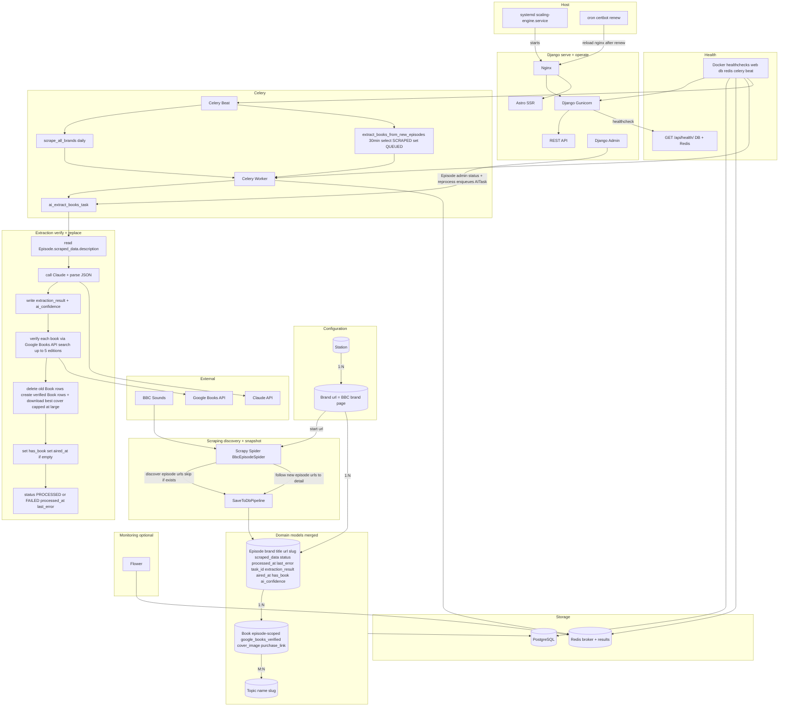
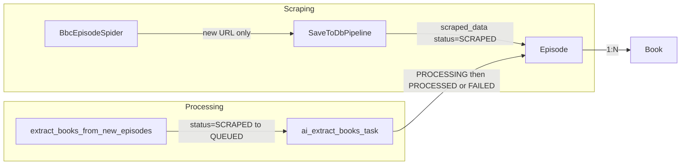

# System architecture (merged design)

This document describes the current system design after merging **RawEpisodeData** into **Episode**: Episode is the single unit of work (snapshot + processing state + output). Scraping, extraction, and admin all operate on Episode.

## Truths / guarantees

- **Scrape source**: The system knows what to scrape from `Brand.url` (BBC show page listing).
- **Discovery**: Episodes are discovered from the listing HTML on each run.
- **Immutability**: An episode is scraped once and never refreshed; BBC descriptions are immutable.
- **Idempotency**: `Episode.url` is unique at DB level; the spider skips when `Episode.objects.filter(url=...).exists()`, so duplicate URLs are never stored.
- **Single unit of work**: Episode holds the scraped snapshot, pipeline status, and derived output (books). There is no separate raw-data table.
- **Reprocessing**: Reprocessing an episode regenerates derived Books deterministically via **replace semantics** (delete all books for the episode, then create new ones from the latest extraction).
- **Verification gate**: A book is only created if Google Books confirms it exists. AI extraction proposes candidates; Google Books verifies them. This prevents non-books (TV shows, films, plays) from entering the database.

## Lifecycle

1. **Scrape**
   - Start from each Brand URL; spider discovers episode URLs from the listing.
   - For each **new** URL: create an Episode (brand, title, url; slug auto), store the full payload in `Episode.scraped_data`, set `Episode.status = SCRAPED`.
   - For existing URLs: do nothing (skip).

2. **Process (scheduled)**
   - Select episodes where `Episode.status == SCRAPED` (e.g. up to 50 per run).
   - Before enqueueing: set `Episode.status = QUEUED`, clear `last_error` (and optionally `processed_at`).
   - Enqueue `ai_extract_books_task.delay(episode.id)`.

3. **Extract + verify + apply**
   - Task sets `Episode.status = PROCESSING`, `task_id = celery_task_id`, `last_error = None`.
   - Read description from `Episode.scraped_data` (title + description); call Claude; parse JSON.
   - Store `Episode.extraction_result` and `Episode.ai_confidence` (debug/admin).
   - For each AI-proposed book: **verify via Google Books API** (`intitle:`/`inauthor:` search). If not found, skip — the candidate is likely not a real book.
   - For verified books: create Book row with corrected title/author from Google Books, download cover image via volume detail endpoint (tokenised URLs), set `google_books_verified=True`.
   - **Replace semantics**: `Book.objects.filter(episode=episode).delete()` before creating new Book rows.
   - Update `Episode.has_book` and, if missing, `Episode.aired_at` from `scraped_data["date_text"]`.
   - Set `Episode.status = PROCESSED`, `Episode.processed_at = now()`, clear `last_error`. On failure: `Episode.status = FAILED`, `Episode.last_error = "<short message>"`.

4. **Operate**
   - Django admin Episode page is the operational cockpit: status chip, scraped description preview, extraction reasoning preview, list of Books, and “Reprocess (AI)” (single and bulk). Optional Flower link when `FLOWER_URL` is set.

## Domain models (merged)

- **Station** → **Brand** (1:N): Brand has `url` = BBC brand/show page.
- **Brand** → **Episode** (1:N): Episode has `url` (unique), `title`, `slug`, `aired_at`, `has_book`, plus:
  - **Snapshot**: `scraped_data` (JSON: url, title, date_text, description, meta_tags, html_title, etc.)
  - **Pipeline**: `status` (SCRAPED | QUEUED | PROCESSING | PROCESSED | FAILED), `processed_at`, `last_error`, `task_id`, `extraction_result`
  - **Confidence**: `ai_confidence` (float 0.0–1.0) — AI's overall confidence in the extraction decision. Colour-coded in admin: green ≥90%, amber ≥70%, red <70%.
- **Episode** → **Book** (1:N): Books are derived from extraction; reprocess replaces all books for that episode. Only books verified by Google Books API are created.
  - **Verification**: `google_books_verified` (bool) — always `True` for created books (unverified candidates are skipped).
  - **Cover**: `cover_image` (ImageField) — downloaded from Google Books volume detail endpoint (tokenised URLs). `cover_fetch_error` (text) — stores last download error or "No cover available on Google Books"; empty when cover is present. Admin shows error in list + detail view, with a "Refetch cover" button (single book) and bulk action.
  - **Purchase**: `purchase_link` — Bookshop.org affiliate link.

Station, Brand, and Phrase are configuration/content; Episode and Book are the scraped and derived data.

## Architecture diagram (full)

## Pipeline flow (high level)

- **Scraping**: Spider discovers episode URLs from Brand page; for new URLs, pipeline creates Episode and sets `scraped_data` and `status=SCRAPED`.
- **Scheduler**: Picks `status=SCRAPED`, sets `QUEUED`, enqueues `ai_extract_books_task`.
- **Extraction**: Task sets `PROCESSING`; reads from `scraped_data`; calls Claude; replaces Books; sets `PROCESSED` or `FAILED` and timestamps/errors on Episode.

## Celery tasks

| Task | Schedule / trigger | Role |
|------|--------------------|------|
| `scrape_all_brands` | Celery Beat (e.g. daily) | Runs Scrapy for each Brand; new episodes get `scraped_data` and `status=SCRAPED`. |
| `extract_books_from_new_episodes` | Celery Beat (e.g. every 30 min) | Selects `Episode.status=SCRAPED`, sets `QUEUED`, enqueues `ai_extract_books_task` per episode. |
| `ai_extract_books_task(episode_id)` | Enqueued by scheduler or admin reprocess | Sets `PROCESSING`, runs extraction, replaces Books, sets `PROCESSED` or `FAILED`. |

## API safety

Public REST API **must not** expose pipeline/debug fields. Episode serializer uses explicit `fields` and **excludes** `scraped_data`, `extraction_result`, `last_error`, `task_id`. Those are for admin and debugging only.

## Key files

| Area | File | Purpose |
|------|------|---------|
| Models | `api/stations/models.py` | Episode (with scraped_data, status, extraction_result, etc.), Book, Brand, Station. |
| Scraping | `api/scraper/pipelines.py` | SaveToDbPipeline: writes `scraped_data` and `status=SCRAPED` to Episode. |
| Scraping | `api/scraper/spiders/bbc_episode_spider.py` | Discovers episode URLs from Brand page; fills `_raw_data_cache` for pipeline. |
| Tasks | `api/stations/tasks.py` | Status transitions; selector by `status=SCRAPED`; enqueue with `QUEUED`. |
| Extraction | `api/stations/ai_utils.py` | Reads `scraped_data`; calls Claude; verifies via Google Books; replaces Books; sets `extraction_result`, `ai_confidence`, `PROCESSED`/`FAILED`. |
| Verification | `api/stations/utils.py` | Google Books API: `intitle:`/`inauthor:` search across multiple editions, two-step cover lookup (search → volume detail for tokenised URLs), ISBN extraction. |
| Frontend | `frontend/` | Astro SSR with React components, Tailwind CSS. Pages: latest, all books, shows, topics, about. |
| Admin | `api/stations/admin.py` | Episode list/change: status, confidence (colour-coded), previews, reprocess single/bulk. Book list/change: cover error column, refetch cover button (single + bulk). Extraction evaluation view. |
| Config | `api/paperwaves/settings.py` | `FLOWER_URL` (optional) for admin “Open Flower” link. |

## Verification philosophy

Book extraction uses a three-layer approach: **AI propose → API verify → human review**.

1. **AI extraction (Claude)**: Reads episode description, proposes book candidates with title + author. Returns an overall `confidence` score (0.0–1.0). The AI handles ~90% of the work but is not infallible — ambiguous descriptions can lead to false positives (e.g. TV shows, film adaptations).

2. **Google Books verification (gate)**: Each AI-proposed book is looked up via the Google Books API using `intitle:`/`inauthor:` search qualifiers. If Google Books returns no result, the candidate is **skipped** — it is likely not a real book. This prevents non-book media (TV shows, plays, musicals) from entering the database. Verified books get corrected metadata (title, author), cover images (via tokenised volume detail URLs), and ISBNs.

3. **Human review (admin)**: Episode admin shows colour-coded `ai_confidence` for quick scanning. Amber/red episodes warrant a glance. This catches edge cases that pass both AI and API (e.g. a real book extracted from the wrong context).

**Why verification is a gate, not just enrichment**: New books that aren't on Google Books yet are an acceptable false negative — they'll appear once indexed. But false positives (non-books in the database) are worse because they erode trust in the data. The gate trades a small risk of missing very new books for high data quality.

**Cover image pipeline**: The lookup fetches up to 5 Google Books search results and picks the edition with the highest-resolution cover (capped at `large`, ~800px — `extraLarge` is overkill for rendered sizes). Google Books volume detail endpoint returns tokenised image URLs (with `imgtk` parameter), but these use the `/books/content` path which 403s from datacenter IPs. `download_and_save_cover()` rewrites URLs to `/books/publisher/content` before downloading — same images, no 403. Open Library is available as a manual fallback (admin refetch only). Cover images are stored locally via Django's `ImageField` + Pillow.

## Data wipe (migrations)

The merge was done with **drop all data**: no backfill from RawEpisodeData. Migrations add the new Episode fields, then truncate Book and Episode (and the old RawEpisodeData table) and remove the RawEpisodeData model. Station/Brand/Phrase are kept so scraping can run against existing brands. After migrations, Episode and Book tables start empty.
