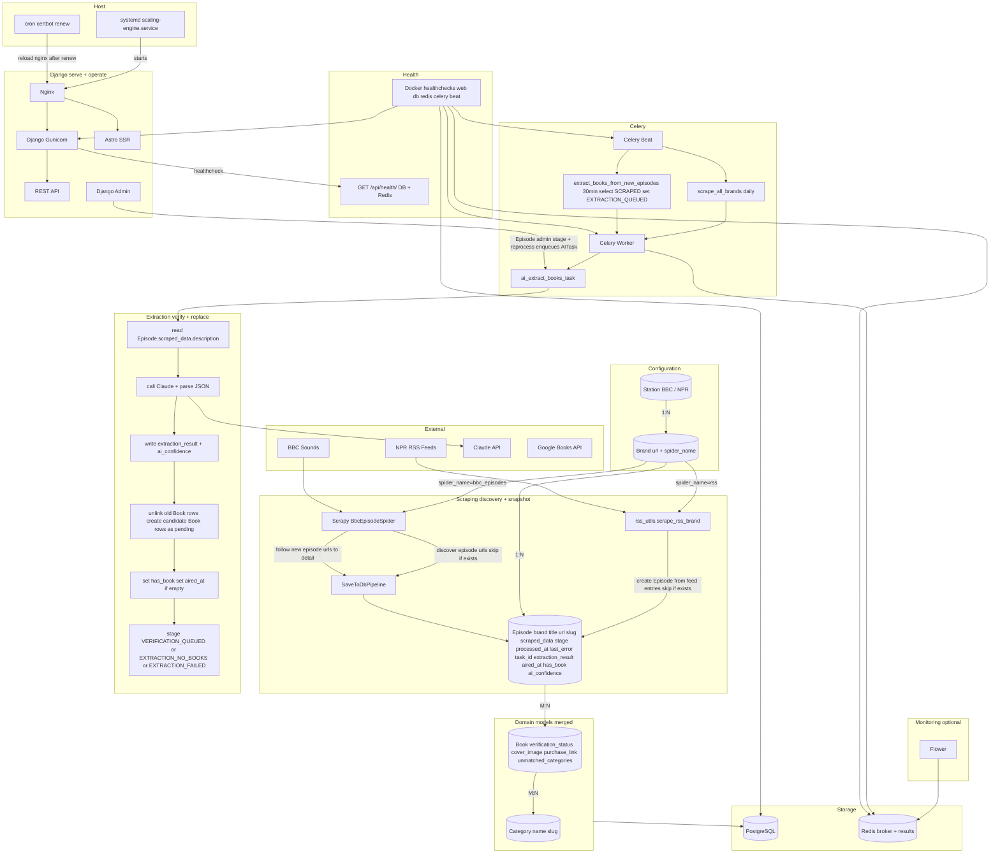
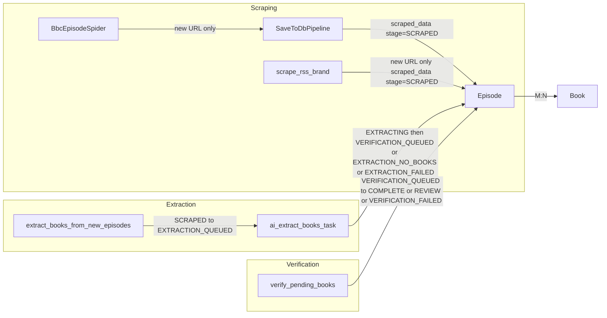

# System architecture (merged design)

This document describes the current system design after merging **RawEpisodeData** into **Episode**: Episode is the single unit of work (snapshot + processing state + output). Scraping, extraction, and admin all operate on Episode.

## Truths / guarantees

- **Scrape source**: The system knows what to scrape from `Brand.url`. For BBC shows this is the programme page listing; for RSS-based shows (e.g. NPR Fresh Air) it is the podcast feed URL.
- **Discovery**: Episodes are discovered from listing HTML (BBC) or RSS entries (podcast feeds) on each run. `Brand.spider_name` controls the dispatch: `"bbc_episodes"` (default) uses Scrapy, `"rss"` uses the lightweight `rss_utils.scrape_rss_brand()` function.
- **Immutability**: An episode is scraped once and never refreshed; descriptions are immutable.
- **Idempotency**: `Episode.url` is unique at DB level; the spider skips when `Episode.objects.filter(url=...).exists()`, so duplicate URLs are never stored.
- **Single unit of work**: Episode holds the scraped snapshot, pipeline status, and derived output (books). There is no separate raw-data table.
- **Reprocessing**: Reprocessing an episode regenerates derived Books deterministically via **replace semantics** (delete all books for the episode, then create new ones from the latest extraction).
- **Verification gate**: AI extraction creates candidate books (pending). Google Books verifies them in a separate hourly task. Unverified books trigger episode REVIEW for human attention. This prevents non-books (TV shows, films, plays) from appearing as confirmed content.

## Lifecycle

Episode lifecycle is tracked by a single `stage` field that captures the full pipeline state:

| Stage | Meaning | Terminal? |
|-------|---------|-----------|
| `SCRAPED` | Just ingested by scraper, awaiting AI | no |
| `EXTRACTION_QUEUED` | Picked up for extraction, waiting for worker | no |
| `EXTRACTING` | AI extraction running now | no |
| `EXTRACTION_NO_BOOKS` | AI ran, found nothing — done | yes |
| `EXTRACTION_FAILED` | Error during extraction, can be retried | no |
| `VERIFICATION_QUEUED` | Books created, pending Google Books check | no |
| `VERIFICATION_FAILED` | Google Books API errors for all books on episode | no |
| `REVIEW` | Needs attention: low confidence or book not found | no |
| `COMPLETE` | All books verified, confidence good (or admin signed off) | yes |

1. **Scrape**
   - Start from each Brand URL; spider discovers episode URLs from the listing.
   - For each **new** URL: create an Episode (brand, title, url; slug auto), store the full payload in `Episode.scraped_data`, set `Episode.stage = SCRAPED`.
   - For existing URLs: do nothing (skip).

2. **Extract (scheduled)**
   - Select episodes where `Episode.stage == SCRAPED` (up to 50 per run).
   - Set `Episode.stage = EXTRACTION_QUEUED`, enqueue `ai_extract_books_task.delay(episode.id)`.
   - Task sets `Episode.stage = EXTRACTING`, reads `scraped_data`, calls Claude, parses JSON.
   - Store `Episode.extraction_result` and `Episode.ai_confidence`.
   - Create candidate Book rows (pending verification). Replace semantics: unlink old books first.
   - Update `Episode.aired_at` if missing.
   - On success: `Episode.stage = VERIFICATION_QUEUED` (if books found) or `EXTRACTION_NO_BOOKS`. On failure: `EXTRACTION_FAILED`.

3. **Verify (scheduled, hourly)**
   - `verify_pending_books` picks up books with `verification_status=pending`.
   - Each book verified via Google Books API (`intitle:`/`inauthor:` search). Verified books get corrected metadata, cover images, ISBNs.
   - After all books for an episode are checked, `compute_stage_after_verification()` evaluates:
     - All books verified + confidence ≥ 0.9 → `COMPLETE`
     - Any book `not_found` or confidence < 0.9 → `REVIEW`
     - All books errored (API failure) → `VERIFICATION_FAILED`
     - Some books still pending → stays `VERIFICATION_QUEUED`

4. **Review (admin)**
   - Episodes at `REVIEW` stage appear in the review queue.
   - Admin can mark as complete → `COMPLETE` (sticky — won't be overwritten by recompute).

5. **Operate**
   - Django admin Episode page is the operational cockpit: colour-coded stage badge, scraped description preview, extraction reasoning preview, list of Books, and “Reprocess (AI)” (single and bulk). System health dashboard shows pipeline stage counts.

## Domain models (merged)

- **Station** → **Brand** (1:N): Brand has `url` (BBC brand page or RSS feed URL), `spider_name` (`"bbc_episodes"` or `"rss"`), `brand_color` (hex).
- **Brand** → **Episode** (1:N): Episode has `url` (unique), `title`, `slug`, `aired_at`, plus:
  - **Snapshot**: `scraped_data` (JSON: url, title, date_text, description, meta_tags, html_title, etc.)
  - **Pipeline**: `stage` (SCRAPED | EXTRACTION_QUEUED | EXTRACTING | EXTRACTION_NO_BOOKS | EXTRACTION_FAILED | VERIFICATION_QUEUED | VERIFICATION_FAILED | REVIEW | COMPLETE), `processed_at`, `last_error`, `task_id`, `extraction_result`
  - **Confidence**: `ai_confidence` (float 0.0–1.0) — AI's overall confidence in the extraction decision. Evaluated after verification: < 0.9 sends episode to REVIEW.
- **Episode** ↔ **Book** (M:N): Books are derived from extraction; reprocess replaces all books for that episode. Books start as pending candidates; Google Books verification promotes them to verified. A book can appear on multiple episodes across shows.
  - **Verification**: `verification_status` (pending | verified | not_found) — per-book. Verified books get corrected metadata from Google Books. Not-found books trigger episode REVIEW.
  - **Cover**: `cover_image` (ImageField) — downloaded from Google Books volume detail endpoint (tokenised URLs). `cover_fetch_error` (text) — stores last download error or "No cover available on Google Books"; empty when cover is present. Admin shows error in list + detail view, with a "Refetch cover" button (single book) and bulk action.
  - **Purchase**: `purchase_link` — Bookshop.org affiliate link.
  - **Category tracking**: `unmatched_categories` (text) — stores comma-separated category slugs the AI suggested that don't match existing Category records. Aggregated on the Category admin changelist as a banner showing suggestion counts.

Station, Brand, and Phrase are configuration/content; Episode and Book are the scraped and derived data.

## Architecture diagram (full)

```mermaid
flowchart TB
  subgraph host [Host]
    systemd[systemd scaling-engine.service]
    cron[cron certbot renew]
  end

  subgraph health [Health]
    APIHealth["GET /api/health/ DB + Redis"]
    DockerHC[Docker healthchecks web db redis celery beat]
  end

  subgraph external [External]
    BBC[BBC Sounds]
    NPR[NPR RSS Feeds]
    Claude[Claude API]
    GoogleBooks[Google Books API]
  end

  subgraph config [Configuration]
    Station[(Station BBC / NPR)]
    Brand[(Brand url + spider_name)]
    Station -->|1:N| Brand
  end

  subgraph scraping [Scraping discovery + snapshot]
    Spider[Scrapy BbcEpisodeSpider]
    RSSUtil[rss_utils.scrape_rss_brand]
    Pipeline[SaveToDbPipeline]
    Brand -->|"spider_name=bbc_episodes"| Spider
    Brand -->|"spider_name=rss"| RSSUtil
    BBC --> Spider
    NPR --> RSSUtil
    Spider -->|discover episode urls skip if exists| Pipeline
    Spider -->|follow new episode urls to detail| Pipeline
    RSSUtil -->|"create Episode from feed entries skip if exists"| Episode
  end

  subgraph django [Django serve + operate]
    Nginx[Nginx]
    Web[Django Gunicorn]
    Frontend[Astro SSR]
    API[REST API]
    Admin[Django Admin]
    Nginx --> Web
    Nginx --> Frontend
    Web --> API
  end

  subgraph models [Domain models merged]
    Episode[(Episode brand title url slug scraped_data stage processed_at last_error task_id extraction_result aired_at has_book ai_confidence)]
    Book[(Book verification_status cover_image purchase_link unmatched_categories)]
    Topic[(Category name slug)]
    Brand -->|1:N| Episode
    Episode -->|M:N| Book
    Book -->|M:N| Topic
  end

  subgraph storage [Storage]
    DB[(PostgreSQL)]
    Redis[(Redis broker + results)]
  end

  subgraph celery [Celery]
    Beat[Celery Beat]
    Worker[Celery Worker]
    ScrapeTask[scrape_all_brands daily]
    DetectTask["extract_books_from_new_episodes 30min select SCRAPED set EXTRACTION_QUEUED"]
    AITask[ai_extract_books_task]
    Beat --> ScrapeTask
    Beat --> DetectTask
    ScrapeTask --> Worker
    DetectTask --> Worker
    Worker --> AITask
  end

  subgraph extraction [Extraction verify + replace]
    ReadSnap["read Episode.scraped_data.description"]
    CallAI["call Claude + parse JSON"]
    SaveResult["write extraction_result + ai_confidence"]
    ReplaceBooks["unlink old Book rows create candidate Book rows as pending"]
    UpdateEpisode["set has_book set aired_at if empty"]
    SetStage["stage VERIFICATION_QUEUED or EXTRACTION_NO_BOOKS or EXTRACTION_FAILED"]
    AITask --> ReadSnap --> CallAI --> SaveResult --> ReplaceBooks --> UpdateEpisode --> SetStage
    CallAI --> Claude
  end

  subgraph monitoring [Monitoring optional]
    Flower[Flower]
    Flower --> Redis
  end

  Pipeline --> Episode
  models --> DB
  Worker --> Redis
  Admin -->|"Episode admin stage + reprocess enqueues AITask"| AITask
  Web -->|healthcheck| APIHealth
  DockerHC --> Web
  DockerHC --> DB
  DockerHC --> Redis
  DockerHC --> Worker
  DockerHC --> Beat
  systemd -->|starts| Nginx
  cron -->|reload nginx after renew| Nginx
```

## Pipeline flow (high level)

```mermaid
flowchart LR
  subgraph scrape [Scraping]
    Spider[BbcEpisodeSpider]
    RSS[scrape_rss_brand]
    Pipeline[SaveToDbPipeline]
    Spider -->|new URL only| Pipeline
    Pipeline -->|scraped_data stage=SCRAPED| Episode[Episode]
    RSS -->|new URL only scraped_data stage=SCRAPED| Episode
  end
  subgraph extract [Extraction]
    Scheduler[extract_books_from_new_episodes]
    AITask[ai_extract_books_task]
    Scheduler -->|SCRAPED to EXTRACTION_QUEUED| AITask
    AITask -->|EXTRACTING then VERIFICATION_QUEUED or EXTRACTION_NO_BOOKS or EXTRACTION_FAILED| Episode
  end
  subgraph verify [Verification]
    VerifyTask[verify_pending_books]
    VerifyTask -->|VERIFICATION_QUEUED to COMPLETE or REVIEW or VERIFICATION_FAILED| Episode
  end
  Episode -->|M:N| Book[Book]
```

- **Scraping**: `scrape_brand()` checks `brand.spider_name` — BBC brands use Scrapy (`BbcEpisodeSpider` via `SaveToDbPipeline`), RSS brands use `scrape_rss_brand()` (simple `feedparser` fetch). Both create Episodes with `scraped_data` and `stage=SCRAPED`, skipping existing URLs.
- **Extraction**: Scheduler picks `stage=SCRAPED`, sets `EXTRACTION_QUEUED`, enqueues `ai_extract_books_task`. Task sets `EXTRACTING`; reads from `scraped_data`; calls Claude; creates candidate Books; sets `VERIFICATION_QUEUED` (books found), `EXTRACTION_NO_BOOKS`, or `EXTRACTION_FAILED`.
- **Verification**: Hourly task checks pending books via Google Books API. After all books for an episode are resolved, computes final stage: `COMPLETE`, `REVIEW`, or `VERIFICATION_FAILED`.

## Celery tasks

| Task | Schedule / trigger | Role |
|------|--------------------|------|
| `scrape_all_brands` | Celery Beat (daily) | Dispatches `scrape_brand` per brand (staggered). Each brand uses Scrapy or RSS based on `spider_name`. |
| `scrape_brand(brand_id)` | Dispatched by `scrape_all_brands` | Checks `brand.spider_name`: `"rss"` → `scrape_rss_brand()`, `"wnyc_api"` → `scrape_wnyc_brand()`, else → Scrapy `BbcEpisodeSpider`. |
| `extract_books_from_new_episodes` | Celery Beat (every 30 min) | Selects `Episode.stage=SCRAPED`, sets `EXTRACTION_QUEUED`, enqueues `ai_extract_books_task` per episode. Also unsticks episodes stuck in `EXTRACTION_QUEUED`/`EXTRACTING` for >60min. |
| `ai_extract_books_task(episode_id)` | Enqueued by scheduler or admin reprocess | Sets `EXTRACTING`, runs extraction, creates candidate Books, sets `VERIFICATION_QUEUED`, `EXTRACTION_NO_BOOKS`, or `EXTRACTION_FAILED`. |
| `verify_pending_books` | Celery Beat (hourly) | Verifies pending books via Google Books API. Updates episode stage to `COMPLETE`, `REVIEW`, or `VERIFICATION_FAILED` based on results. |

## API safety

Public REST API **must not** expose pipeline/debug fields. Episode serializer uses explicit `fields` and **excludes** `scraped_data`, `extraction_result`, `last_error`, `task_id`. Those are for admin and debugging only.

## Key files

| Area | File | Purpose |
|------|------|---------|
| Models | `api/stations/models.py` | Episode (with scraped_data, stage, extraction_result, etc.), Book (with verification_status, unmatched_categories), Brand (with spider_name), Station, Category. |
| Scraping (BBC) | `api/scraper/spiders/bbc_episode_spider.py` | Discovers episode URLs from Brand page; fills `_raw_data_cache` for pipeline. |
| Scraping (BBC) | `api/scraper/pipelines.py` | SaveToDbPipeline: writes `scraped_data` and `stage=SCRAPED` to Episode. |
| Scraping (RSS) | `api/stations/rss_utils.py` | Generic RSS scraper via `feedparser`. Works for any brand with `spider_name=”rss”`. |
| Tasks | `api/stations/tasks.py` | Spider-agnostic dispatch (`scrape_brand` checks `brand.spider_name`); stage transitions; extraction scheduling; verification scheduling. |
| Extraction | `api/stations/ai_utils.py` | Reads `scraped_data`; calls Claude; creates candidate Books; tracks unmatched categories; parses dates (BBC + RFC 2822). |
| Verification | `api/stations/utils.py` | Google Books API: `intitle:`/`inauthor:` search across multiple editions, two-step cover lookup (search → volume detail for tokenised URLs), ISBN extraction. |
| Frontend | `frontend/` | Astro SSR with React components, Tailwind CSS. Pages: latest, all books, shows, topics, about. |
| Admin | `api/stations/admin.py` | Episode list/change: colour-coded stage badge, confidence, previews, reprocess single/bulk. Review queue for REVIEW episodes. System health dashboard with stage counts. Book list/change: cover error column, refetch cover button (single + bulk). Category list: unmatched AI suggestions banner. Extraction evaluation view. |
| Config | `api/paperwaves/settings.py` | `FLOWER_URL` (optional) for admin “Open Flower” link. |

## Verification philosophy

Book extraction uses a three-layer approach: **AI propose → API verify → human review**.

1. **AI extraction (Claude)**: Reads episode description, proposes book candidates with title + author. Returns an overall `confidence` score (0.0–1.0). The AI handles ~90% of the work but is not infallible — ambiguous descriptions can lead to false positives (e.g. TV shows, film adaptations). After extraction, episode moves to `VERIFICATION_QUEUED` (books found) or `EXTRACTION_NO_BOOKS`.

2. **Google Books verification (separate stage)**: Each pending book is looked up via the Google Books API using `intitle:`/`inauthor:` search qualifiers. Verified books get corrected metadata (title, author), cover images (via tokenised volume detail URLs), and ISBNs. Books not found are marked `not_found`, triggering the episode to enter `REVIEW`. After all books are resolved, the episode stage is computed: `COMPLETE` (all verified, confidence ≥ 0.9), `REVIEW` (any not_found or low confidence), or `VERIFICATION_FAILED` (API errors).

3. **Human review (admin)**: Episodes at `REVIEW` stage appear in a dedicated review queue. Admin can inspect, edit books, and mark the episode as `COMPLETE` (sticky — won't be overwritten). This catches edge cases that pass both AI and API (e.g. a real book extracted from the wrong context).

**Key principle**: Extraction creates *candidates*. Nothing goes to REVIEW until verification has run. Confidence is only evaluated after verification confirms the books exist.

**Why verification matters**: New books that aren't on Google Books yet are an acceptable false negative — they'll appear once indexed. But false positives (non-books in the database) are worse because they erode trust in the data.

**Cover image pipeline**: The lookup fetches up to 5 Google Books search results and picks the edition with the highest-resolution cover (capped at `large`, ~800px — `extraLarge` is overkill for rendered sizes). Google Books volume detail endpoint returns tokenised image URLs (with `imgtk` parameter), but these use the `/books/content` path which 403s from datacenter IPs. `download_and_save_cover()` rewrites URLs to `/books/publisher/content` before downloading — same images, no 403. Open Library is available as a manual fallback (admin refetch only). Cover images are stored locally via Django's `ImageField` + Pillow.

## Data wipe (migrations)

The merge was done with **drop all data**: no backfill from RawEpisodeData. Migrations add the new Episode fields, then truncate Book and Episode (and the old RawEpisodeData table) and remove the RawEpisodeData model. Station/Brand/Phrase are kept so scraping can run against existing brands. After migrations, Episode and Book tables start empty.
