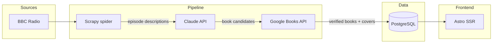

# Radio Reads

[radioreads.fun](https://radioreads.fun)

Radio Reads tracks books discussed, reviewed and recommended on radio programmes. Each episode is checked for books that are the subject of the conversation — author interviews, reviews, prize announcements — and added to a searchable archive.

Currently covers BBC Radio 4 shows including Front Row, Bookclub and Free Thinking.

## How it works

The system scrapes BBC Radio episode listings daily, then uses Claude to read each episode description and propose book candidates. Proposed books are verified against the Google Books API before being added to the database — this prevents non-book media (TV shows, films, plays) from slipping through.

The pipeline:

1. **Scrape** — Scrapy spider discovers new episodes from BBC programme pages
2. **Extract** — Claude reads the episode description and proposes books with title + author
3. **Verify** — Each candidate is checked against Google Books; unverified candidates are discarded
4. **Enrich** — Verified books get corrected metadata, cover images, ISBNs and purchase links

Cover images are fetched from the Google Books edition with the best available resolution across multiple search results. The Google Books `/books/content` path 403s from datacenter IPs, so URLs are rewritten to `/books/publisher/content` which serves the same images.

## Stack

- **Backend**: Django, Django REST Framework, Celery + Redis, Scrapy
- **AI**: Anthropic Claude API (book extraction)
- **Frontend**: Astro (SSR) with React components, Tailwind CSS
- **Database**: PostgreSQL
- **Deployment**: Docker Compose, Nginx, GitHub Actions

## Architecture



The verification approach uses three layers: **AI propose → API verify → human review**. False positives (non-books in the database) are worse than false negatives (missing a very new book), so Google Books acts as a gate rather than just enrichment.

See [ARCHITECTURE.md](ARCHITECTURE.md) for the full system design, domain models, and detailed pipeline diagrams.

## Scheduling & operations

- **Celery + Redis** handle async work: scraping runs daily at 2 AM, book extraction every 30 minutes, both via Celery Beat
- **Health endpoint**: `GET /api/health/` checks DB, Redis, Celery workers, beat staleness, SSL cert expiry, and pipeline metrics — returns 503 if unhealthy
- **Admin tools**: Django admin has single + bulk reprocess buttons, cover refetch, colour-coded AI confidence scores, and filterable review status
- **Management commands**: `reprocess_all`, `categorize_books`, `populate_purchase_links`, `download_book_covers`, `regenerate_book_slugs`

## Development

```bash
docker-compose -f docker-compose.dev.yml up --build
```

Services: nginx (8080), Django (8000), Astro (3000), PostgreSQL (5433), Redis, Celery worker + beat.

Env files: `.env.dev`, `.env.dev.db`.

```bash
# Manual scrape
docker-compose -f docker-compose.dev.yml exec web sh -c "scrapy crawl bbc_episodes -a brand_id=2"

# Manual extraction (Django shell)
from stations.tasks import extract_books_from_new_episodes
extract_books_from_new_episodes()
```
