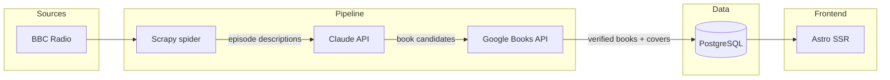

# Radio Reads

[radioreads.fun](https://radioreads.fun)

Radio Reads tracks books discussed, reviewed and recommended on radio programmes. Each episode is checked for books that are the subject of the conversation — author interviews, reviews, prize announcements — and added to a searchable archive.

Currently covers 11 shows across BBC Radio 3/4, NPR, WNYC and other podcast feeds, including Front Row, Bookclub, Free Thinking, Start the Week, Fresh Air, Book of the Day and The Splendid Table.

## How it works

The system scrapes episode listings daily (BBC pages, podcast RSS feeds and the WNYC API), then uses Claude to read each episode description and propose book candidates. Proposed books are verified against the Google Books API before being added to the database — this prevents non-book media (TV shows, films, plays) from slipping through.

The pipeline:

1. **Scrape** — a Scrapy spider (BBC), a generic RSS reader or the WNYC JSON API discovers new episodes
2. **Extract** — Claude reads the episode description and proposes books with title + author
3. **Verify** — Each candidate is checked against Google Books; unverified candidates are discarded
4. **Enrich** — Verified books get corrected metadata, cover images, ISBNs and purchase links

Cover images are fetched from the Google Books edition with the best available resolution across multiple search results. The Google Books `/books/content` path 403s from datacenter IPs, so URLs are rewritten to `/books/publisher/content` which serves the same images.

## Stack

| Layer | Technology |
|-------|------------|
| **Hosting** | DigitalOcean droplet (2 GB RAM + swap), Ubuntu, systemd, cron |
| **Containers** | Docker + Docker Compose (immutable images in prod, volume-mounted in dev) |
| **Reverse proxy / web server** | Nginx 1.28: TLS termination, HTTP/2, gzip, 60s page cache (`proxy_cache`, stale-while-revalidate), security headers, www → apex redirect |
| **TLS** | Let's Encrypt via certbot (webroot), renewed by cron (`deploy/renew-cert.sh`) |
| **App server** | Gunicorn (gthread workers) for Django; Bun running the Astro Node standalone server |
| **Backend** | Python 3.12, Django 5.2 LTS, Django REST Framework, django-cors-headers, argon2 password hashing |
| **Task queue** | Celery + Celery Beat (django-celery-beat), Redis 7 as broker/result store, Flower for monitoring |
| **Database** | PostgreSQL 16 |
| **Scraping** | Scrapy (BBC), feedparser (RSS), WNYC JSON API client |
| **AI** | Anthropic Claude API (book extraction, blurbs) |
| **Book data** | Google Books API (verification, covers, ISBNs), Open Library (cover fallback) |
| **Images** | Pillow: cover download plus 160/240/400px WebP thumbnails served via `srcset` |
| **Frontend** | Astro 7 (SSR, `@astrojs/node`, no client framework), Tailwind CSS, TypeScript, self-hosted EB Garamond + Inter via Fontsource |
| **Monetisation** | Bookshop.org affiliate links |
| **Web analytics** | PostHog: page views and Listen/Buy clicks sent server-side (no browser SDK; bots, prerenders and Lighthouse excluded) |
| **Error tracking** | PostHog: Django, Celery and Astro SSR errors |
| **Testing** | pytest, pytest-django, factory-boy (backend); Vitest, Testing Library, Astro container API (frontend); `astro check` for types |
| **CI/CD** | GitHub Actions: tests then SSH deploy on push to `master`, smoke test through nginx |
| **Performance monitoring** | Lighthouse CI (after deploys + daily, with budgets) |
| **Uptime monitoring** | UptimeRobot, plus a GitHub Actions check of the homepage, `/api/health/` and cert expiry every 30 min |
| **Server automation** | `deploy/watchdog.sh` (auto-restart, disk prune), nightly `pg_dump` backups (14 days), weekly Docker prune |

## Architecture


```mermaid
flowchart LR
  subgraph sources [Sources]
    BBC[BBC Radio]
  end

  subgraph pipeline [Pipeline]
    Spider[Scrapy spider]
    Claude[Claude API]
    GB[Google Books API]
    Spider -->|episode descriptions| Claude
    Claude -->|book candidates| GB
  end

  subgraph data [Data]
    DB[(PostgreSQL)]
    GB -->|verified books + covers| DB
  end

  subgraph frontend [Frontend]
    Astro[Astro SSR]
    DB --> Astro
  end

  BBC --> Spider
```

The verification approach uses three layers: **AI propose → API verify → human review**. False positives (non-books in the database) are worse than false negatives (missing a very new book), so Google Books acts as a gate rather than just enrichment.

See [ARCHITECTURE.md](ARCHITECTURE.md) for the full system design, domain models, and detailed pipeline diagrams.

## Scheduling & operations

- **Celery + Redis** handle async work: scraping runs daily at 2 AM, book extraction every 30 minutes and Google Books verification hourly, all via Celery Beat
- **Health endpoint**: `GET /api/health/` checks DB, Redis, Celery workers, beat staleness, SSL cert expiry, and pipeline metrics — returns 503 if unhealthy
- **Admin tools**: Django admin has single + bulk reprocess buttons, cover refetch, colour-coded AI confidence scores, and filterable review status
- **Management commands**: `reprocess_all`, `categorize_books`, `populate_purchase_links`, `download_book_covers`, `regenerate_book_slugs`

## Development

```bash
docker-compose -f docker-compose.dev.yml up --build
```

Services: nginx (8080), Django (8000), Astro (3000), PostgreSQL (5433), Redis, Celery worker + beat.

Env files: `.env.dev`, `.env.dev.db`.

```bash
# Manual scrape
docker-compose -f docker-compose.dev.yml exec web sh -c "scrapy crawl bbc_episodes -a brand_id=2"

# Manual extraction (Django shell)
from stations.tasks import extract_books_from_new_episodes
extract_books_from_new_episodes()
```
